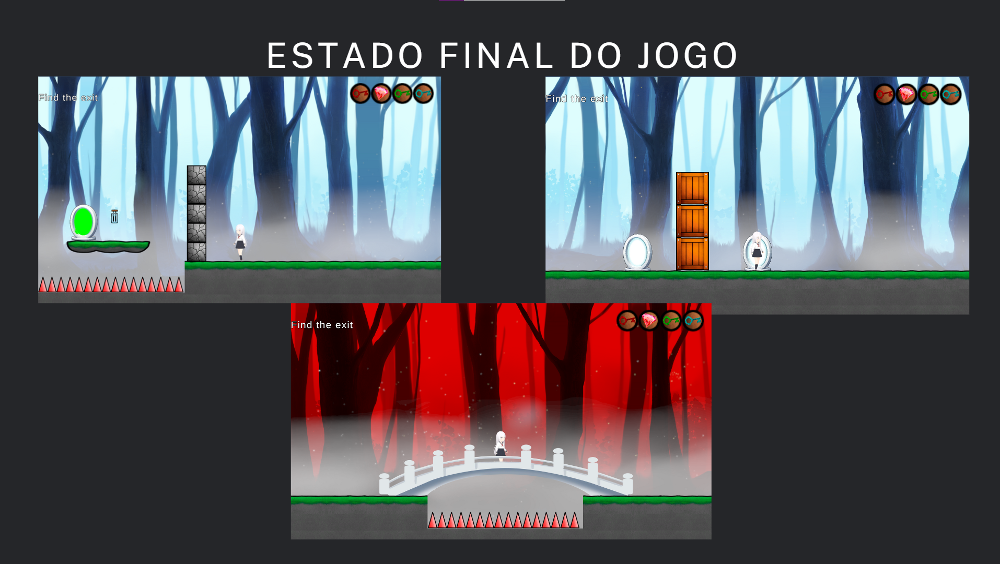
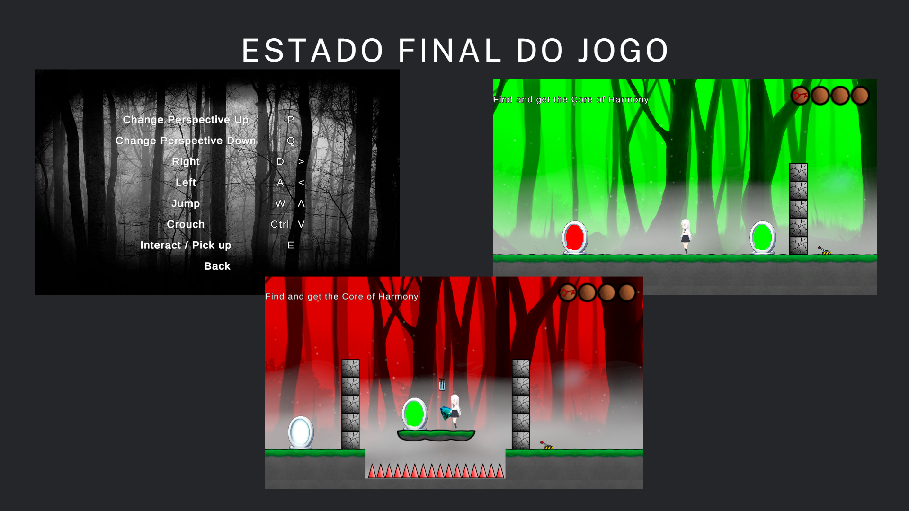
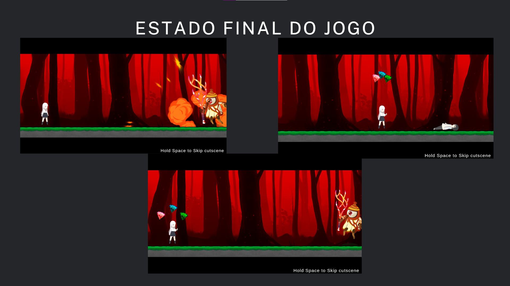

# Shades of Void - Apresentação Final

## Autores
- **Luís Neto**, Nº 2020215474
- **Pedro Ascensão**, Nº 2020233012
- **Tomás Pinto**, Nº 2020224069

---

## Conceito do Jogo

"Shades of Void" é um jogo 2D composto por vários níveis onde o jogador pode movimentar-se entre três mundos diferentes. Se o progresso for impedido em um dos mundos, o jogador pode tentar avançar nos outros dois. Cada mundo é preenchido com obstáculos que desafiam o jogador.

### História
A narrativa do jogo é revelada à medida que o jogador avança pelos níveis. A história gira em torno dos guardiões que roubam o **Core** e matam o **Echo**, fragmentando o Universo. A missão de **Lyra**, a personagem principal, é reviver **Echo** e restaurar o **Core of Harmony**.

---

## Estado Final do Jogo

**Estado Atual:**
- Implementação de todos os níveis previstos.
- Introdução de uma cutscene final para explicar o desfecho do jogo.
- Adicionada a funcionalidade de ignorar a cutscene para jogadores que desejam avançar diretamente para o jogo.
- Briefing incluído para orientar o jogador em cada nível.
- Melhorias na movimentação da personagem principal, tornando-a mais rápida e responsiva.
- Transições entre mundos otimizadas, permitindo ao jogador retornar ao mundo anterior sem precisar passar por todos os mundos em sequência.

## Últimas Melhorias Realizadas

- **Nível Final**: Implementação e testes completos do nível final.
- **Cutscene Final**: Animação e narração adicionadas para explicar o fim do jogo.
- **Briefing**: Inserção de instruções e dicas no início de cada nível.
- **Melhorias na Movimentação**: Ajustes na velocidade e fluidez dos movimentos da personagem principal.
- **Novos Objetos e Obstáculos**: Inclusão de picos, alavancas, pontes e chaves para enriquecer a jogabilidade.
- **Novas Mecânicas de Jogo**:
  - Uso de alavancas para criar pontes sobre os picos.
  - Uso de chaves para acessar portais específicos.
- **Melhoria dos Efeitos Sonoros**: Adição e aprimoramento dos efeitos sonoros para melhorar a imersão.

